# AWS EKS WordPress Deployment
[](https://www.terraform.io/)
[](https://www.ansible.com/)
[](https://github.com/features/actions)
[](LICENSE)

🇪🇸 [Spanish version and more info](./docs/es/README-es.md)

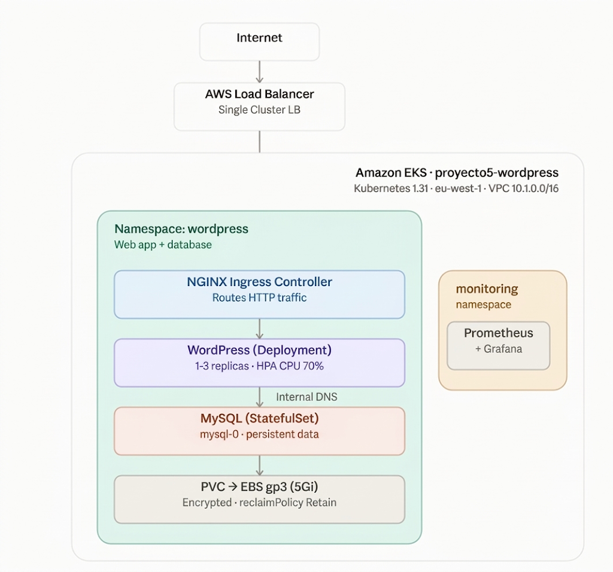  

+ A resilient, scalable, and automated infrastructure deployment of WordPress running on Amazon Elastic Kubernetes Service (Amazon EKS), provisioned using Terraform and deployed via Helm/Kubernetes manifests, observability and CI/CD..

## Table of contents

- [Architecture Decisions](#architecture-decisions)
- [Infrastructure Verification](#infrastructure-verification)
- [How to install and run the project](#how-to-install-and-run-the-project)
- [How to use the project](#how-to-use-the-project)`
- [Stack](#stack)
- [Status](#status)
- [Author](#author)

## Architecture Decisions

- **Amazon EKS Managed Node Groups:** Offloads Kubernetes control plane maintenance to AWS while leveraging auto-scaling worker nodes for workload reliability.
- **Decoupled Architecture:** WordPress application pods run in the EKS cluster, while the MySQL database is decoupled using **Amazon RDS (MySQL)** for better scaling, isolated backups, and high availability.
- **Persistent Storage:** Utilizes AWS EBS / EFS CSI Drivers to provide persistent storage volumes for WordPress uploads and persistent state across pod restarts.
- **AWS Load Balancer Controller:** Automatically provisions and manages AWS Application Load Balancers (ALB) based on Kubernetes Ingress resources to route external HTTP/HTTPS traffic smoothly.
- **IaC with Terraform & Remote State:** Infrastructure state is managed with S3 state locks to guarantee consistent, team-safe provisioning.
- **Observability:** Deploys Prometheus and Grafana for metrics collection, resource monitoring, and cluster health visibility.
- **GitOps & Continuous Deployment (ArgoCD):** Synchronizes application and infrastructure manifests automatically from the GitHub repository to the EKS cluster.

## Infrastructure Verification

Before deploying application workloads, verify that your EKS cluster and nodes are fully functional:

- `kubectl get nodes` showing the 2 t3.small nodes in the `Ready` state.
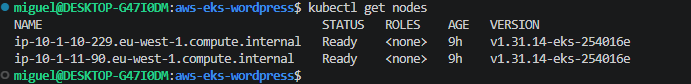  

- `kubectl get pods -A` showing MySQL, WordPress, the Ingress Controller, and the monitoring stack in the `Running` state.
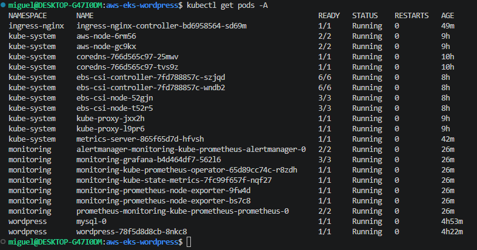  

- AWS Console, `proyecto5-wordpress` cluster active.  
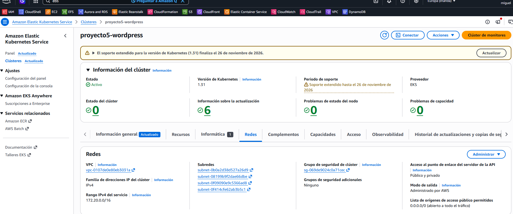  
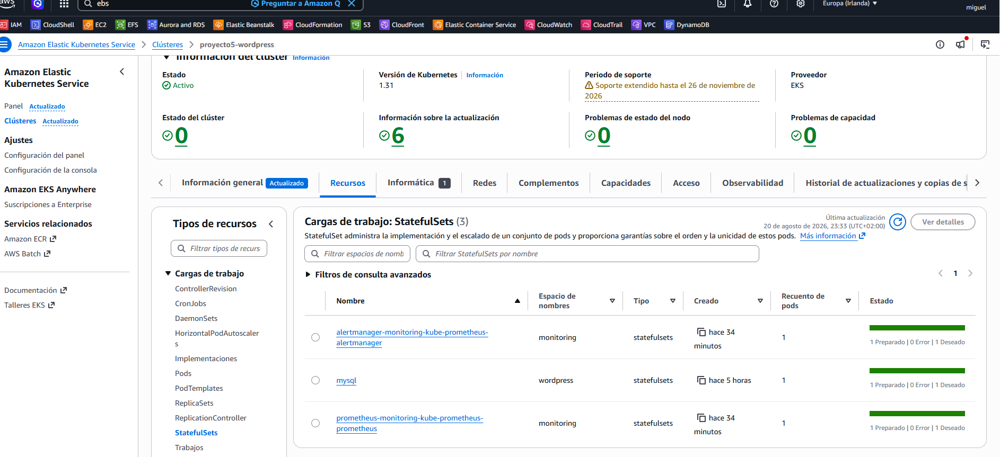  

- AWS Console, `proyecto5-wordpress` volumes active.
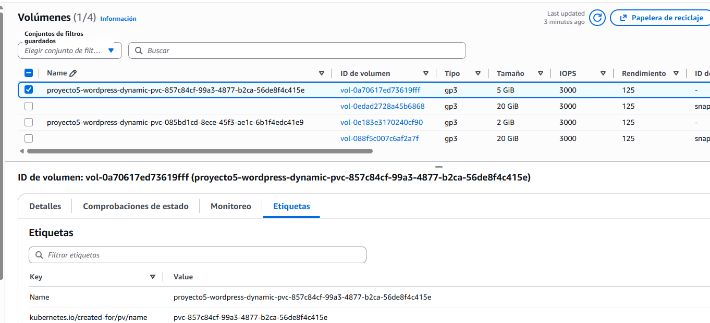  

- AWS Console, `proyecto5-wordpress` VPC active.
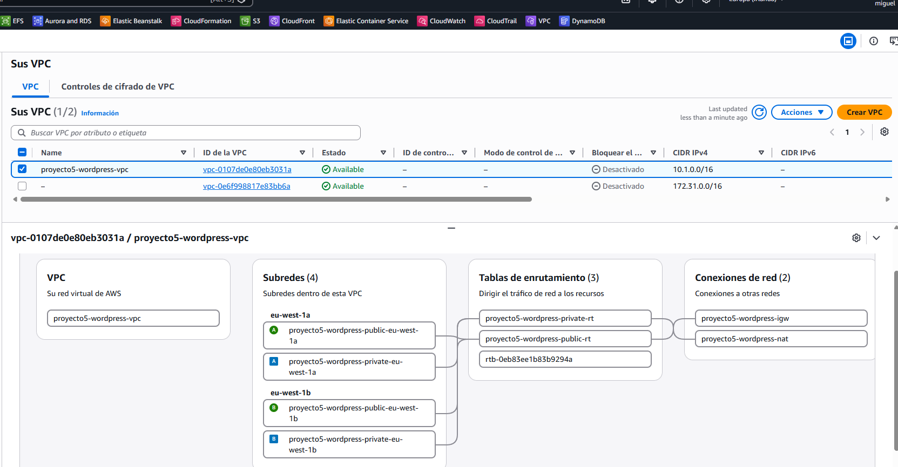  

- AWS Console, IAM roles and providers active:
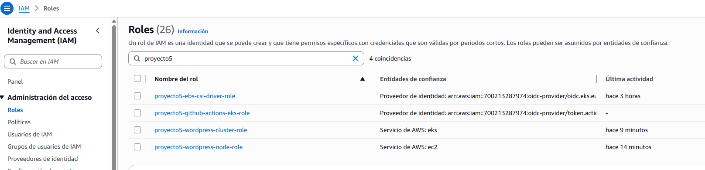  
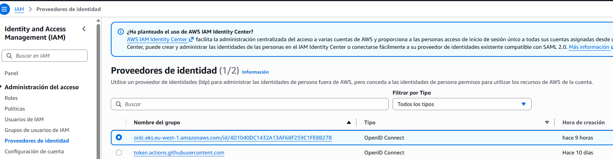  

- AWS Console, Ingress Load Balancer with its DNS name.
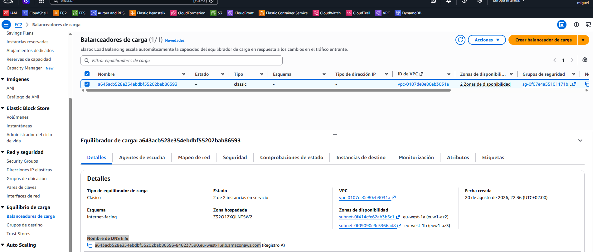  

- WordPress loading in the browser via the Ingress public URL (not `localhost`).
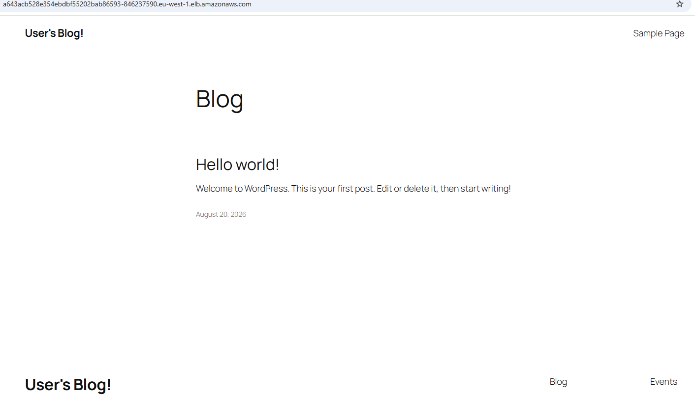  

- `kubectl get hpa -n wordpress` during a load test; `REPLICAS` scaled from 1 to 2-3.
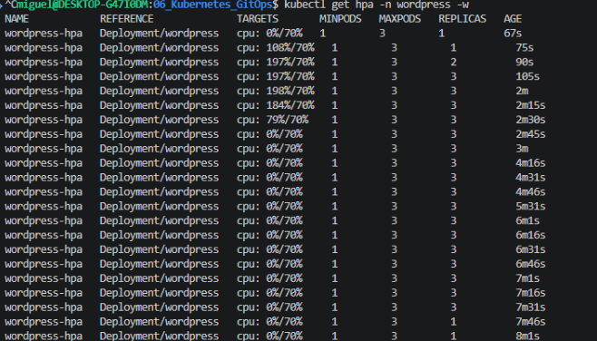  

- Pre-built dashboard "Kubernetes / Compute Resources / Namespace (Pods)" filtered by `wordpress`.
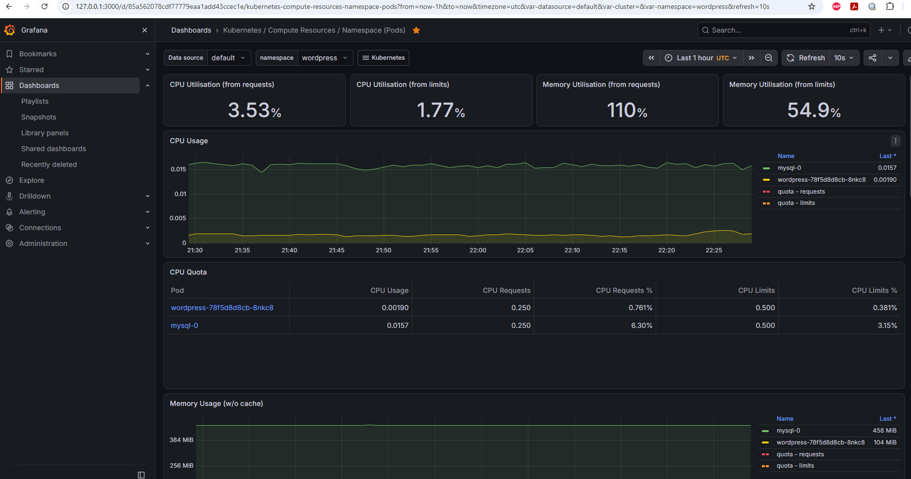  

- Custom dashboard showing CPU, memory, disk, and replica metrics.
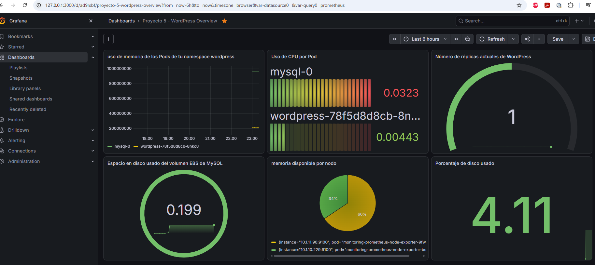  

- GitHub Actions workflows for validate, diff, and apply.
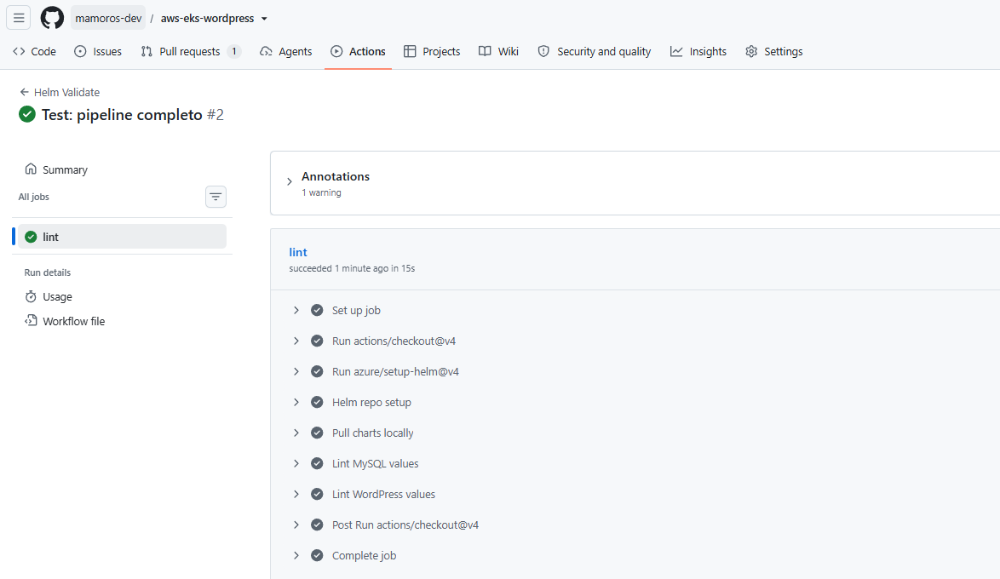  
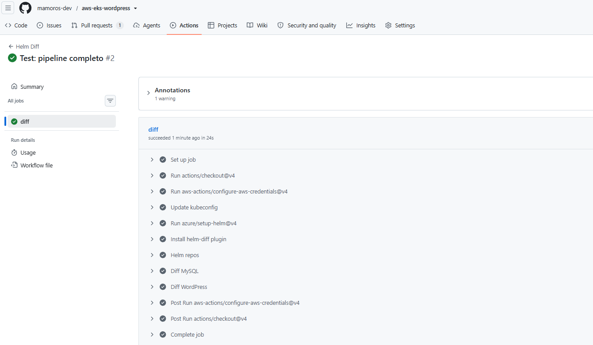  
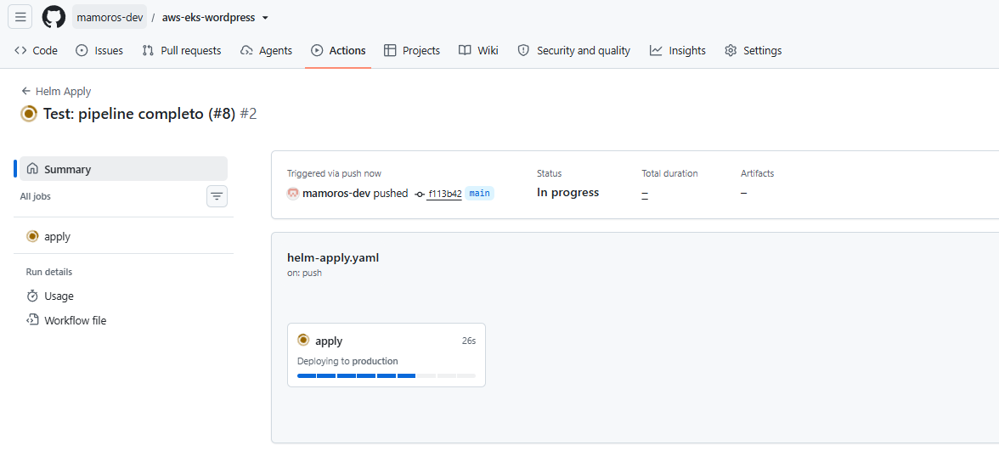  
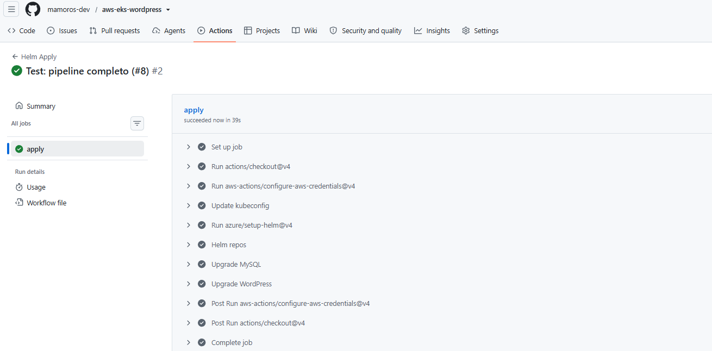

## How to install and run the project

**Prerequisites:**
   - AWS CLI configured with valid administrator credentials.
   - Terraform (>= 1.5.0) installed.
   - kubectl installed.
   - Helm (v3+) installed.

1. **Clone the Repository:**
```bash
git clone https://github.com/mamoros-dev/aws-eks-wordpress.git
cd aws-eks-wordpress
```

2. **Provision Infrastructure with Terraform**  
Navigate to the IaC directory and initialize Terraform:
```bash
cd infra
terraform init
terraform plan
terraform apply -auto-approve
```

3. **Configure Local kubectl Context**  
Update your local kubeconfig to interact with the newly created EKS cluster:
```bash
aws eks update-kubeconfig --region us-east-1 --name <your-eks-cluster-name>
```

4. **GITHUB ACTIONS:**
The repository includes automated CI workflows located in `.github/workflows/` to ensure code quality and infrastructure validation before merging changes.

5. **Define StorageClass gp3 and namespace**  
Navigate to the Kubernetes/Helm configurations directory:
```bash
kubectl apply -f k8s/storageclass.yaml
kubectl create namespace wordpress
```

6. **Create Secrets consumed by Helm**
```bash
kubectl create secret generic mysql-root-secret \
  --namespace wordpress \
  --from-literal=mysql-root-password="YourSecureRootPassword123!" \
  --from-literal=mysql-password="YourSecureUserPassword123!"

kubectl create secret generic wordpress-db-secret \
  --namespace wordpress \
  --from-literal=mariadb-password="YourSecureUserPassword123!"
```

7. **Ingress Controller y Objets K8s**
```bash
helm repo add ingress-nginx https://kubernetes.github.io/ingress-nginx
helm repo update
helm install ingress-nginx ingress-nginx/ingress-nginx \
  --namespace ingress-nginx \
  --create-namespace

kubectl apply -f k8s/wordpress-ingress.yaml
kubectl apply -f k8s/wordpress-hpa.yaml
```

8. **Helm Applications**
```bash
helm repo add bitnami https://charts.bitnami.com/bitnami
helm repo update

helm install mysql bitnami/mysql -n wordpress --values helm/mysql-values.yaml

helm install wordpress bitnami/wordpress -n wordpress --values helm/wordpress-values.yaml \
  --set image.repository=bitnamilegacy/wordpress \
  --set image.tag=latest \
  --set global.security.allowInsecureImages=true
```

9. **Wordpress credentials**
```bash
kubectl get secret --namespace wordpress wordpress -o jsonpath="{.data.wordpress-username}" | base64 -d; echo

kubectl get secret --namespace wordpress wordpress -o jsonpath="{.data.wordpress-password}" | base64 -d; echo
```
> Username: user

10. **Observability (Prometheus & Grafana)**
```bash
kubectl create namespace monitoring

helm repo add prometheus-community https://prometheus-community.github.io/helm-charts
helm repo update

helm install prometheus prometheus-community/kube-prometheus-stack \
  --namespace monitoring \
  --set grafana.adminPassword="AdminPassword123!"

kubectl port-forward svc/prometheus-grafana -n monitoring 3000:80

kubectl port-forward svc/prometheus-kube-prometheus-prometheus -n monitoring 9090:9090
```
> Username: admin

11. **Observability: ArgoCD**
```bash
# Creater the namespace
kubectl create namespace argocd

#  Apply the official ArgoCD manifests.
kubectl apply -n argocd -f https://raw.githubusercontent.com/argoproj/argo-cd/stable/manifests/install.yaml

kubectl -n argocd get secret argocd-initial-admin-secret -o jsonpath="{.data.password}" | base64 -d; echo

kubectl port-forward svc/argocd-server -n argocd 8080:443
```
> Username: admin  
> check pods argoCD `kubectl rollout status deployment argocd-server -n argocd`


## How to use the project

1. **Get Load Balancer URL:**  
Retrieve the external address assigned by the AWS ALB Controller:
   ```Bash
   kubectl get ingress -n wordpress
   # OR
   kubectl get svc -n wordpress
   ```

2. **Access WordPress:**  
Open your browser and navigate to the `EXTERNAL-IP` / DNS endpoint provided by the Load Balancer.

3. **Admin Dashboard Access:**  
Log into the WordPress administrative panel by appending `/wp-admin` to your ALB domain name using the credentials defined during deployment or stored in AWS Secrets Manager / Kubernetes Secrets.
> kubectl port-forward svc/wordpress 8080:80

4. **Observability & Monitoring: Prometheus, Grafana, Alertmanager:**  
   - **ArgoCD:** kubectl port-forward svc/argocd-server -n argocd 8084:443
   - **Grafana:** kubectl port-forward deployment/prometheus-grafana -n monitoring 3000:3000
   - **Prometheus:** kubectl port-forward svc/prometheus-kube-prometheus-prometheus -n monitoring 9090:9090

5. **Clean Architecture**
```bash
cd infra
terraform destroy --auto-approve
```

## Stack
- Cloud Provider: AWS (EKS, EC2, VPC, IAM, EBS, S3)
- Infrastructure as Code: Terraform
- Container Orchestration: Kubernetes (EKS Managed Node Groups)
- Database & Storage: MySQL, Persistent Volumes (PVC)
- Package Management: Helm
- GitOps Continuous Delivery: ArgoCD
- Observability & Monitoring: Prometheus, Grafana, Alertmanager
- Local Environment: WSL2 Ubuntu / Linux

## Status
+ **Completed** — Fully functional IaC and Kubernetes deployment setup ready for production-like evaluation and cloud portfolio demonstration.

## Author
+ Miguel — [GitHub](https://github.com/mamoros-dev) · [LinkedIn](https://www.linkedin.com/in/miguel-amoros-moret/)