# Proyecto 5 — WordPress + MySQL en Kubernetes

+ Migración de una arquitectura clásica WordPress + MySQL a un clúster de Kubernetes gestionado en AWS (EKS), aplicando principios de infraestructura como código, almacenamiento persistente, autoescalado, observabilidad y CI/CD.

## Arquitectura

```
Internet
   │
   ▼
[NGINX Ingress Controller] ── Load Balancer único (AWS NLB/CLB)
   │
   ▼
[Service: wordpress] (ClusterIP)
   │
   ▼
[Deployment: wordpress] ──── HPA (1-3 réplicas, CPU 70%)
   │
   │  DNS interno: mysql.wordpress.svc.cluster.local
   ▼
[Service: mysql] (ClusterIP + Headless)
   │
   ▼
[StatefulSet: mysql-0]
   │
   ▼
[PVC → PV → Volumen EBS gp3, 5Gi, cifrado]

Observabilidad: Prometheus + Grafana (namespace monitoring)
Storage: EBS CSI Driver + StorageClass ebs-gp3 (IRSA)
CI/CD: GitHub Actions + OIDC → IAM Role → EKS Access Entry
```

**Región:** `eu-west-1` (Irlanda)  
**Clúster:** `proyecto5-wordpress` — Kubernetes v1.31  
**VPC:** `10.1.0.0/16` — 2 subredes públicas + 2 privadas (eu-west-1a/1b)  
**Nodos:** 2× `t3.small` en subred privada (restricción de cuenta AWS Academy/Educate — Free Tier únicamente)  

## Estructura del repositorio

```
.
├── infra/
│   ├── backend.tf              # Backend remoto S3 (reutiliza bucket de resto proyectos)
│   ├── provider.tf
│   ├── variables.tf
│   ├── vpc.tf                  # VPC dedicada 10.1.0.0/16
│   ├── eks.tf                  # Clúster EKS, node group, access entries
│   ├── outputs.tf
│   └── iam.tf                  # OIDC providers, IAM roles (IRSA), GitHub Actions role
├── helm/
│   ├── mysql-values.yaml
│   └── wordpress-values.yaml
├── k8s/
│   ├── storageclass.yaml        # StorageClass ebs-gp3
│   ├── wordpress-ingress.yaml
│   └── wordpress-hpa.yaml
├── .github/workflows/
│   ├── helm-validate.yaml   # Lint en cada PR
│   ├── helm-diff.yaml       # helm diff en cada PR
│   └── helm-apply.yaml      # helm upgrade en merge a main (aprobación manual)
└── docs/images/
```

## Decisiones de arquitectura relevantes

+ **Backend Terraform con locking nativo S3 (`use_lockfile = true`)**:  
Se reutiliza el bucket `miguel-terraform-state-proyecto2` bajo la ruta `proyecto5/terraform.tfstate`, sustituyendo la tabla DynamoDB de proyectos anteriores por el locking nativo de S3 — mismo objetivo (evitar aplicaciones concurrentes), menos infraestructura que mantener.

+ **MySQL dentro del clúster, no en RDS**:  
Decisión deliberadamente pedagógica. En un entorno de producción real, la recomendación estándar sería **RDS gestionado para la base de datos + EKS únicamente para la capa stateless (WordPress)** — separando el ciclo de vida del dato del ciclo de vida del clúster. Este proyecto despliega MySQL dentro de Kubernetes para entender en profundidad el modelo de almacenamiento persistente (StorageClass / PVC / PV / CSI Driver), StatefulSets y el patrón cliente-servidor interno — conocimiento transferible a cualquier aplicación con estado en Kubernetes, no solo bases de datos.

+ **Ingress en vez de un LoadBalancer por Service**:  
Un `Service type: LoadBalancer` por aplicación implicaría un Load Balancer de AWS (con coste fijo) por cada servicio expuesto. El Ingress Controller centraliza la entrada en un único Load Balancer, con el enrutamiento resuelto a nivel de aplicación dentro del clúster — patrón estándar en clústeres con múltiples servicios.

+ **IRSA en lugar de permisos a nivel de nodo**:  
Tanto el EBS CSI Driver como el pipeline de GitHub Actions usan **IAM Roles for Service Accounts**, otorgando permisos de AWS a nivel de Pod/ServiceAccount individual en lugar de al nodo EC2 completo — principio de mínimo privilegio, mismo patrón aplicado en Proyecto 4 con OIDC de GitHub.

+ **CI/CD tradicional (push) en lugar de GitOps**:  
El pipeline actual empuja cambios activamente desde GitHub Actions hacia el clúster. Una evolución natural de este proyecto sería adoptar **GitOps** (ArgoCD o Flux): un agente dentro del propio clúster que vigila el repositorio y aplica cambios automáticamente, con auto-reconciliación y sin necesidad de credenciales AWS en GitHub Actions. Se documenta como mejora futura, no implementada en esta iteración.

## Lecciones de Kubernetes (troubleshooting real)

**1. Retirada del catálogo gratuito de Bitnami (`docker.io/bitnami` → `bitnamilegacy`)**
Durante el despliegue, los Pods de MySQL y WordPress fallaron con `ImagePullBackOff` / `NotFound`. Causa: Broadcom retiró en 2025-2026 las imágenes gratuitas del repositorio `docker.io/bitnami`, moviéndolas a un catálogo de pago (Bitnami Secure Images) y dejando una copia sin mantenimiento futuro en `docker.io/bitnamilegacy`. Solución aplicada: apuntar `image.repository` a `bitnamilegacy/<app>` y habilitar `global.security.allowInsecureImages: true`. Lección: dependencias de terceros "gratuitas" pueden cambiar de modelo de negocio sin aviso — mitigación real en producción sería un registro de contenedores propio (ECR) con imágenes propias o congeladas.

**2. Nombre de clave incorrecto en Secret (`mysql-password` vs `mariadb-password`)**
El chart de WordPress, al usar `externalDatabase.existingSecret`, espera una clave llamada exactamente `mariadb-password` dentro del Secret (herencia de que Bitnami usa MariaDB como motor por defecto). Usar un nombre distinto no provoca un error explícito, sino un `WARN` silencioso seguido de un fallback a `ALLOW_EMPTY_PASSWORD=yes` y fallo de conexión a base de datos. Lección: los logs de inicialización de un contenedor (no solo los errores) pueden contener la causa raíz real de un fallo aparentemente no relacionado.

**3. Zonalidad de EBS y `WaitForFirstConsumer`**
Los volúmenes EBS son recursos zonales (viven en una AZ concreta). Usar `volumeBindingMode: WaitForFirstConsumer` en la StorageClass retrasa la creación del volumen hasta que el Pod ya tiene nodo asignado, evitando un desajuste de AZ entre el volumen y el nodo que lo monta.

**4. Uso de memoria en nodos t3.small con stack completo**
Con MySQL + WordPress + Ingress Controller + kube-prometheus-stack corriendo simultáneamente, el uso de memoria de los nodos alcanza ~82-86%. Con el HPA activo escalando WordPress bajo carga, existe riesgo real de Pods en `Pending` por falta de memoria (`FailedScheduling: Insufficient memory`). Mitigación aplicada: `resources.requests/limits` explícitos en todos los charts y retención reducida de Prometheus (3 días). En un clúster de producción, este escenario apuntaría a añadir un Cluster Autoscaler o nodos de mayor tamaño.

**5. `authentication_mode` del clúster EKS y EKS Access Entries**
Al añadir `aws_eks_access_entry`/`aws_eks_access_policy_association` para dar acceso al pipeline de CI/CD (Bloque 10), Terraform falló con `InvalidRequestException: cluster's authentication mode must be set to API or API_AND_CONFIG_MAP`. El clúster, creado sin especificar `access_config`, había quedado en el modo heredado `CONFIG_MAP`. Solución: añadir `access_config { authentication_mode = "API_AND_CONFIG_MAP", bootstrap_cluster_creator_admin_permissions = true }` al recurso `aws_eks_cluster`, como modificación in-place sin recrear el clúster. Lección: IAM controla quién puede *entrar* al clúster (`eks:DescribeCluster`); lo que esa identidad puede *hacer* dentro es un sistema de autorización propio de Kubernetes (Access Entries o RBAC clásico vía ConfigMap), independiente de IAM.

**6. Cambio de formato del claim `sub` en tokens OIDC de GitHub Actions**
La trust policy del IAM Role para GitHub Actions, escrita con el formato `repo:owner/repo:*`, rechazaba la autenticación con `Not authorized to perform sts:AssumeRoleWithWebIdentity`. Un workflow de debug decodificando el JWT real reveló que GitHub había cambiado el formato del claim `sub` a identificadores numéricos inmutables (`repo:owner@ownerID/repo@repoID:*`), y que el uso de `environment:` en el job cambia además el sufijo del claim (`:environment:production` en vez de `:ref:refs/heads/main`). Lección: nunca asumir el formato exacto de un claim de identidad federada sin verificarlo en un token real — los proveedores pueden cambiar el formato sin previo aviso, y una condición `StringLike` con comodín en el sufijo es más robusta que una coincidencia exacta frente a distintos triggers de un mismo repo.

**7. Los Environments de GitHub Actions son específicos por repositorio**
El gate de aprobación manual (`environment: production`) configurado en el repositorio de Proyecto 4 no se traslada automáticamente a este repositorio nuevo — cada repo requiere su propia configuración de Environment con *required reviewers* en Settings → Environments. Sin esta configuración, el workflow de apply se ejecuta sin pausa, aplicando cambios reales al clúster sin punto de control humano.

## Infraestructura desplegada y funcionando

Evidencia real de la infraestructura desplegada (capturas en `docs/images/`):

- `kubectl get nodes` con los 2 nodos t3.small en estado `Ready`.
  

- `kubectl get pods -A` con MySQL, WordPress, Ingress Controller y stack de monitorización en `Running`.
  

- Consola AWS, clúster `proyecto5-wordpress` activo.  
  
  

- Consola AWS, Volumes `proyecto5-wordpress` activos.
  

- Consola AWS, VPC `proyecto5-wordpress` activo.
  

- Consola AWS, IAM roles y providers activos:
  
  

- Consola AWS, Load Balancer del Ingress con su DNS name.
  

- WordPress cargando en el navegador vía la URL pública del Ingress (no `localhost`).
  

- `kubectl get hpa -n wordpress` durante prueba de carga, `REPLICAS` escalado de 1 a 2-3.
  

- Dashboard preconstruido `Kubernetes / Compute Resources / Namespace (Pods)` filtrado por `wordpress`.
  

- Dashboard propio con métricas de CPU, memoria, disco y réplicas.
  

- Workflows con Github Actions para validate, diff y apply.
  
  
  
  


## Prueba de que funciona de verdad, no solo en el diagrama

+ ### Comprobación para verificar que un cambio realizado en el deployment de wordpress se despliega vía pipeline y llega realmente al clúster:

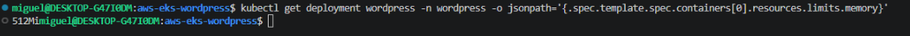  
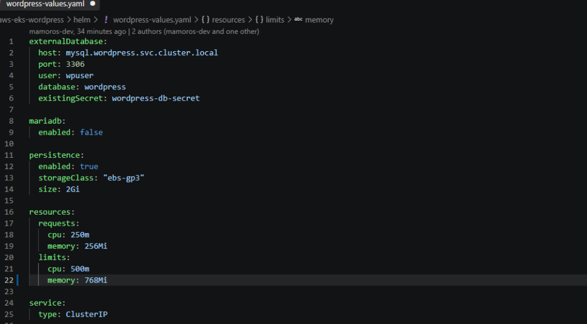  
> Modificamos el valor de Memory  

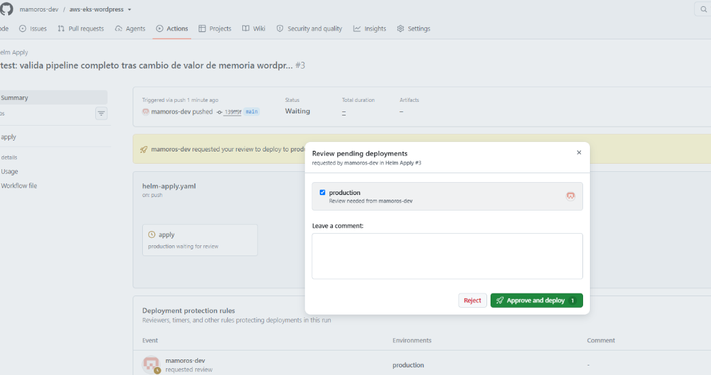  
> Hacemos un push a main y vemos que hace el workflow con siempre aprobación manual del merge del Pull Request realizado  

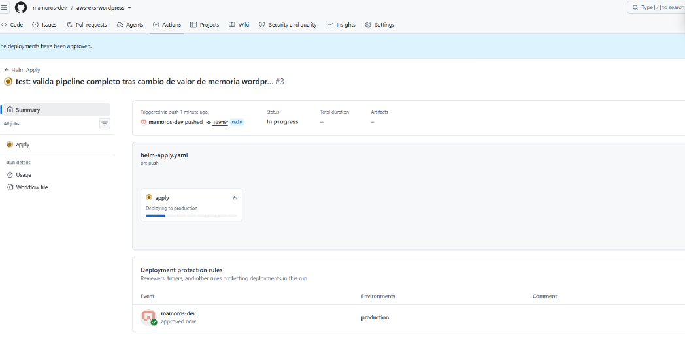  
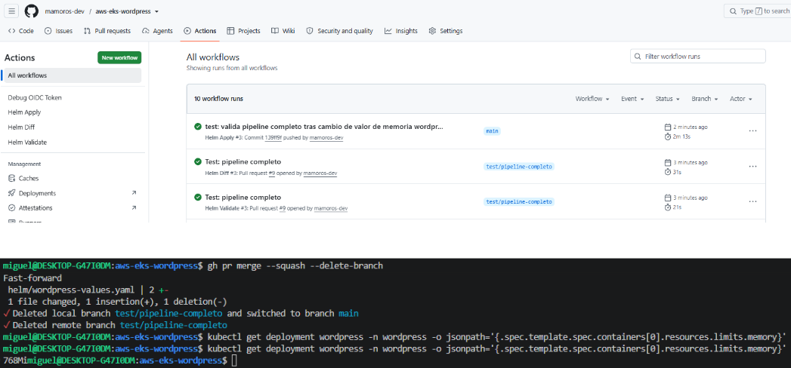  
> Comprobamos que el cluster tiene ahora el valor nuevo desplegado con el comando:
```bash
kubectl get deployment wordpress -n wordpress -o jsonpath='{.spec.template.spec.containers[0].resources.limits.memory}'
```

+ ### Comprobación del funcionamiento de wordpress con mysql con la creación de un nuevo post en el blog de la página web mediando el acceso al panel de administración:
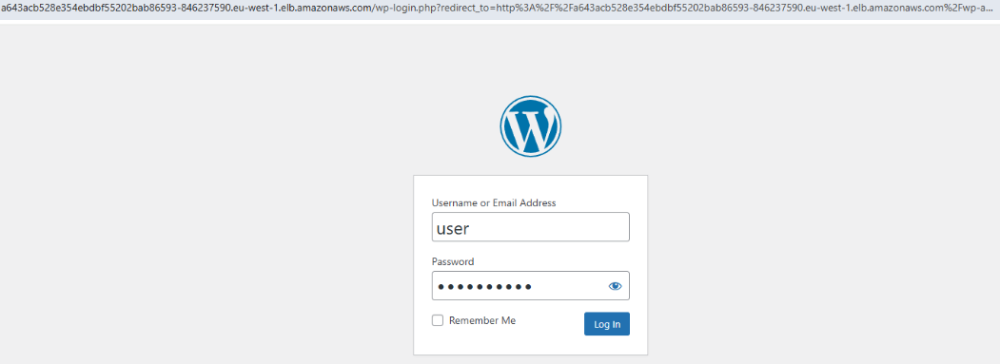  
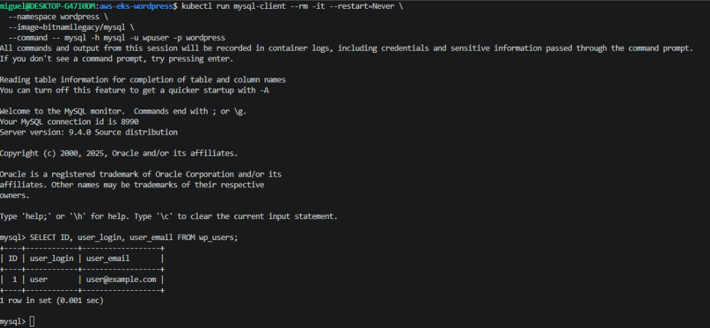  
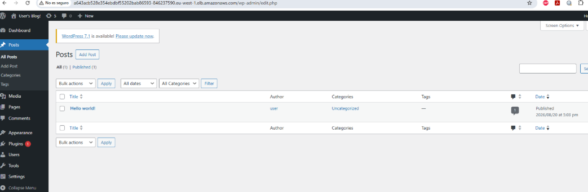  
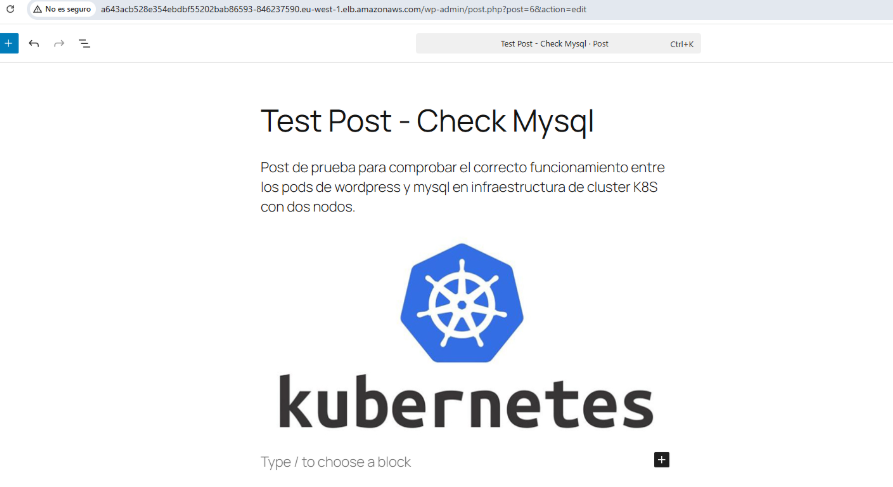  
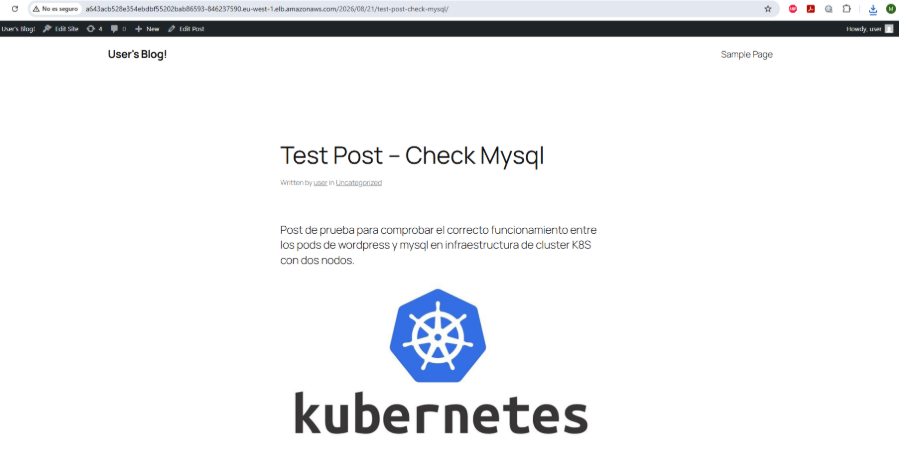  
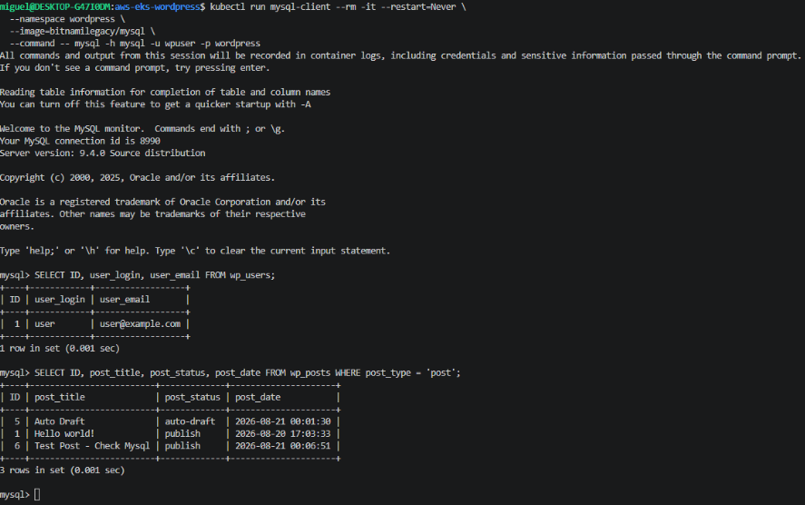  

## Cómo desplegar desde cero

```bash
# 1. Infraestructura base
terraform init
terraform apply

# 2. Configurar kubectl
aws eks update-kubeconfig --name proyecto5-wordpress --region eu-west-1

# 3. Namespace y Secrets (no versionados en Git)
kubectl create namespace wordpress
kubectl create secret generic mysql-root-secret --namespace wordpress \
  --from-literal=mysql-root-password='<password-segura>' \
  --from-literal=mysql-password='<password-segura>'
kubectl create secret generic wordpress-db-secret --namespace wordpress \
  --from-literal=mariadb-password='<misma-password-mysql-password>'

# 4. StorageClass
kubectl apply -f storageclass.yaml

# 5. Helm charts (repos)
helm repo add bitnami https://charts.bitnami.com/bitnami
helm repo add ingress-nginx https://kubernetes.github.io/ingress-nginx
helm repo add prometheus-community https://prometheus-community.github.io/helm-charts
helm repo update

# 6. MySQL, esperar a Running antes de continuar
helm install mysql bitnami/mysql --namespace wordpress --values helm/mysql-values.yaml

# 7. WordPress
helm install wordpress bitnami/wordpress --namespace wordpress --values helm/wordpress-values.yaml \
  --set image.repository=bitnamilegacy/wordpress \
  --set image.tag=latest \
  --set global.security.allowInsecureImages=true

# 8. Ingress Controller + recursos Ingress/HPA
helm install ingress-nginx ingress-nginx/ingress-nginx --namespace ingress-nginx \
  --create-namespace --set controller.service.type=LoadBalancer
kubectl apply -f k8s/wordpress-ingress.yaml
kubectl apply -f k8s/wordpress-hpa.yaml

# 9. Monitorización
helm install monitoring prometheus-community/kube-prometheus-stack \
  --namespace monitoring --create-namespace --values helm/monitoring-values.yaml
```

## Cómo destruir (fin de sesión, evitar coste nocturno)

```bash
kubectl delete ingress wordpress-ingress -n wordpress
helm uninstall monitoring -n monitoring
helm uninstall wordpress mysql -n wordpress
helm uninstall ingress-nginx -n ingress-nginx
kubectl get pvc --all-namespaces   # verificar que no quedan volúmenes huérfanos
terraform destroy
```
> NOTA: como los volumenes tienen la propiedad `reclaimPolicy: Retain` sobrevive incluso a `terraform destroy`**. Los volúmenes EBS creados dinámicamente por el CSI Driver no están gestionados por Terraform (no aparecen en el `.tfstate`). Con `reclaimPolicy: Retain`, borrar el PVC o incluso destruir el clúster completo con `terraform destroy` no elimina el volumen EBS subyacente — queda huérfano y sigue facturando.   

> Verificación y limpieza correcta tras cualquier destroy: `aws ec2 describe-volumes --filters "Name=status,Values=available"` y `aws ec2 delete-volume --volume-id <id>` para cualquier resultado relacionado con el proyecto.

## Stack técnico

| Capa | Herramienta |
|---|---|
| IaC | Terraform (backend S3 con locking nativo, sin DynamoDB) |
| Orquestación | Kubernetes 1.31 (Amazon EKS) |
| Empaquetado de apps | Helm 3 (charts Bitnami) |
| Almacenamiento persistente | EBS CSI Driver + StorageClass dinámica (gp3, cifrado) |
| Exposición externa | NGINX Ingress Controller |
| Autoescalado | HorizontalPodAutoscaler + Metrics Server |
| Observabilidad | kube-prometheus-stack (Prometheus + Grafana + Alertmanager) |
| CI/CD | GitHub Actions con autenticación OIDC (sin claves estáticas) |
| Identidad AWS↔K8s | IRSA (IAM Roles for Service Accounts) + EKS Access Entries |

## ⚠️ Nota sobre costes

+ Este proyecto genera coste real mientras el clúster EKS está activo (~$0.19-0.20/hora incluyendo NAT Gateway, sin contar Load Balancer ni volúmenes EBS adicionales). 
+ Se recomienda `terraform destroy` al final de cada sesión de trabajo. Al no persistir los volúmenes EBS entre sesiones, los datos de WordPress/MySQL no sobreviven a un ciclo destroy/apply — decisión consciente para este proyecto de portfolio, priorizando coste mínimo sobre persistencia de datos de prueba.

## Estado

**Proyecto completado** — Verificado de extremo a extremo, incluyendo pipeline de CI/CD funcional con aprobación manual.

## Autor

+ Miguel — [GitHub](https://github.com/mamoros-dev) · [LinkedIn](https://www.linkedin.com/in/miguel-amoros-moret/)